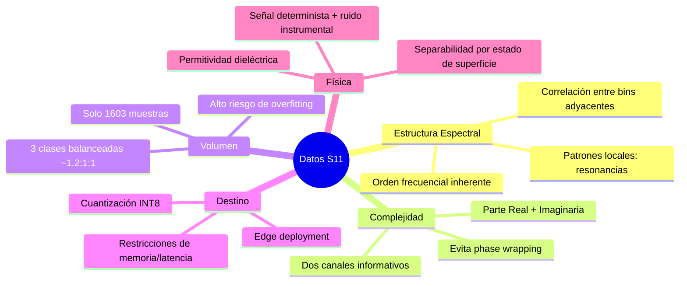
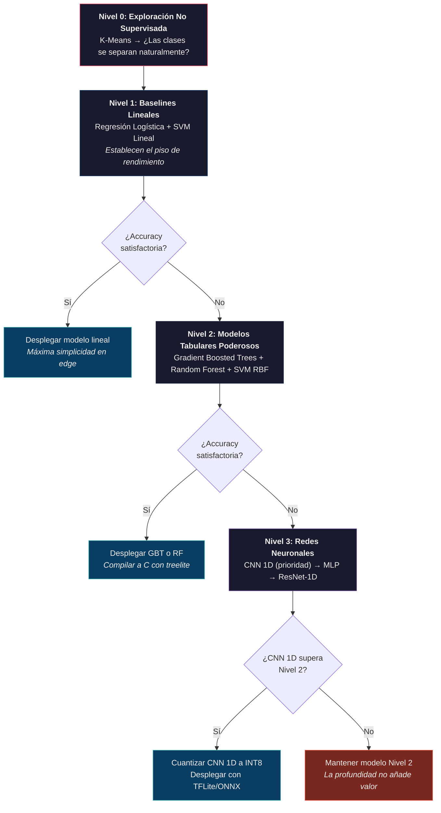

# Propuesta de Modelos de IA para Clasificación de Datos S11

**Análisis basado en la naturaleza de los datos del sensor RF (8–12 GHz)**  
**Junio 2026**

---

## 1. Naturaleza de los Datos: Columnas y su Significado Físico

El dataset se estructura con las siguientes columnas:

| Columna | Tipo | Significado Físico |
|---------|------|--------------------|
| `Archivo_Origen` | Categórico / ID | Identificador de traza. Vincula cada muestra al archivo `.s1p` original. No es un feature de entrada al modelo, sino metadato de trazabilidad. |
| `Estado_Sensor` | Categórico (3 clases) | **Variable objetivo (target)**. Representa el estado de la superficie: `dry`, `wet`, `ice`. Es la etiqueta que el modelo debe predecir. |
| `Frecuencia (Hz)` | Numérico continuo | Eje independiente del barrido. 4001 puntos uniformes de 8.0 a ~12.0 GHz. Define la posición espectral de cada medición. |
| `S11_Real` | Numérico continuo | Parte real del coeficiente de reflexión complejo S₁₁(f). Codifica información sobre la impedancia del sensor. |
| `S11_Imaginario` | Numérico continuo | Parte imaginaria del coeficiente de reflexión complejo S₁₁(f). Junto con la parte real, reconstruye la magnitud y fase completa. |

> [!IMPORTANT]
> La representación en **Real + Imaginario** es la forma cartesiana del coeficiente de reflexión complejo:
> $$S_{11}(f) = \text{Re}[S_{11}(f)] + j \cdot \text{Im}[S_{11}(f)]$$
> Esto es equivalente (e interconvertible) a la representación polar **Magnitud (dB) + Fase (°)** que describe el documento fuente. La forma cartesiana evita los problemas de *phase wrapping* (discontinuidades artificiales de ±180°) que complican el entrenamiento de modelos basados en gradientes.

### 1.1 Estructura Vectorial de Cada Muestra

Cada muestra de entrenamiento es un **vector complejo de 4001 dimensiones**:

$$\mathbf{x} = [S_{11}(f_1), S_{11}(f_2), \ldots, S_{11}(f_{4001})]^T \in \mathbb{C}^{4001}$$

o equivalentemente, un vector real bidimensional:

$$\mathbf{x} = \begin{bmatrix} \text{Re}[S_{11}(f_1)], \ldots, \text{Re}[S_{11}(f_{4001})] \\ \text{Im}[S_{11}(f_1)], \ldots, \text{Im}[S_{11}(f_{4001})] \end{bmatrix} \in \mathbb{R}^{4001 \times 2}$$

Esto implica una **dimensionalidad efectiva de 8002 features** cuando se aplana para modelos clásicos, o un tensor `(4001, 2)` para modelos convolucionales 1D.

### 1.2 Propiedades Clave de los Datos que Condicionan la Elección del Modelo



---

## 2. Análisis y Justificación de Modelos Candidatos

### 2.1 Modelos Lineales

---

#### 2.1.1 Regresión Logística (Softmax Multinomial)

**Función**: Computa una transformación lineal sobre el vector de features seguida de softmax para asignar probabilidades a las 3 clases.

**¿Por qué es idóneo para estos datos?**

| Criterio | Evaluación |
|----------|-----------|
| Compatibilidad con la estructura | ✅ Opera directamente sobre el vector aplanado $\mathbf{x} \in \mathbb{R}^{8002}$. Cada peso $w_j$ se asocia a un bin de frecuencia específico (Real o Imaginario), lo que permite interpretar qué frecuencias y qué componente (Re/Im) son más discriminantes. |
| Riesgo de overfitting | ✅ **Bajo**. ~12,000 parámetros para 1603 muestras (ratio ~7:1). Regularización L2 controla la norma de los pesos. |
| Despliegue en edge | ✅ **Excelente**. El forward pass es una sola multiplicación matriz-vector $\mathbf{W}\mathbf{x} + \mathbf{b}$ seguida de softmax. Implementable en aritmética entera con cuantización trivial. |
| Interpretabilidad | ✅ **Máxima**. Los pesos entrenados generan un "mapa espectral de importancia" directamente legible para ingenieros de RF. |

**Justificación desde la física**: Si la separabilidad entre dry/wet/ice es fundamentalmente lineal en el espacio Re/Im (lo cual es plausible dado que los cambios de permitividad producen desplazamientos cuasi-lineales en el plano complejo de S₁₁ para perturbaciones moderadas), la regresión logística capturará la frontera óptima con mínimo riesgo de sobreajuste.

**Rol en el pipeline**: **Baseline obligatorio**. Todo modelo más complejo debe superar esta referencia para justificar su complejidad adicional.

---

#### 2.1.2 SVM Lineal (Support Vector Machine con kernel lineal)

**Función**: Encuentra el hiperplano de máximo margen que separa las clases en el espacio de alta dimensión.

**¿Por qué es idóneo para estos datos?**

| Criterio | Evaluación |
|----------|-----------|
| Regularización estructural | ✅ El principio de máximo margen proporciona **regularización implícita** especialmente valiosa con N=1603. A diferencia de la regresión logística que minimiza el log-loss, SVM maximiza la distancia geométrica a la frontera de decisión. |
| Ratio muestras/dimensiones | ✅ SVMs lineales manejan bien escenarios donde $d > N$ o $d \approx N$. Con 8002 features y 1603 muestras, SVM es históricamente robusto. |
| Edge deployment | ✅ La inferencia se reduce a: $\hat{y} = \text{sign}(\mathbf{w}^T\mathbf{x} + b)$. Un dot product. |
| Datos espectrales | ✅ La correlación entre bins de frecuencia adyacentes crea una estructura suave en el espacio de features que SVM explota eficientemente. |

**Justificación desde la física**: Los vectores de soporte seleccionados por el entrenamiento son las trazas S11 que se encuentran en la **frontera entre estados físicos** (e.g., una muestra "almost-dry" vs. "barely-wet"). Esto tiene interpretación directa: son los casos límite donde la permitividad superficial está en transición.

---

#### 2.1.3 SVM con Kernel RBF (Radial Basis Function)

**Función**: Proyecta implícitamente los datos a un espacio de dimensionalidad infinita donde las fronteras no lineales se vuelven lineales.

**¿Por qué es idóneo para estos datos?**

| Criterio | Evaluación |
|----------|-----------|
| No linealidad en S11 | ✅ Las resonancias del sensor (dips en magnitud, transiciones rápidas de fase) producen patrones altamente **no lineales** en el plano complejo. Un cambio de estado dry→wet no solo desplaza la curva S11, sino que modifica su forma: ancho de resonancia, profundidad, acoplamiento. RBF captura estas distorsiones de forma. |
| Muestras pequeñas | ⚠️ **Moderado**. El kernel RBF tiene dos hiperparámetros críticos (C, γ) que requieren búsqueda exhaustiva. Con N=1603, la búsqueda en nested CV es computacionalmente factible. |
| Edge deployment | ⚠️ La inferencia depende del número de vectores de soporte. Si el conjunto es disperso (típico cuando las clases son bien separables), el costo es aceptable. |
| Captura de interacciones frecuenciales | ✅ El kernel RBF implícitamente modela interacciones entre **todos los pares de bins de frecuencia**, algo que los modelos lineales ignoran. |

**Justificación desde la física**: La relación entre $\varepsilon^*$ (permitividad compleja) y S₁₁ es mediada por las ecuaciones de Maxwell y la geometría del sensor, produciendo una transformación **no lineal** del estado de superficie al espacio de medición. El kernel RBF es la herramienta clásica para capturar estas no linealidades sin especificar explícitamente la función de mapeo.

---

### 2.2 Modelos Basados en Ensambles de Árboles

---

#### 2.2.1 Random Forest

**Función**: Ensemble de árboles de decisión decorrelados (bagging), cada uno entrenado sobre un subconjunto aleatorio de features y muestras.

**¿Por qué es idóneo para estos datos?**

| Criterio | Evaluación |
|----------|-----------|
| Robustez ante ruido | ✅ El promediado sobre cientos de árboles suaviza la varianza del estimador. Cada árbol individual puede sobreajustar, pero el ensemble no. Ideal para datos con ruido instrumental. |
| Feature importance nativa | ✅ Proporciona un ranking de importancia por feature (bin de frecuencia × componente Re/Im), revelando directamente qué **regiones espectrales** discriminan entre estados. Esto es invaluable para la validación física del modelo. |
| Sin suposiciones de distribución | ✅ No asume linealidad, gaussianidad, ni ninguna forma funcional. Trata Re e Im como features independientes que puede combinar arbitrariamente en cada split. |
| Edge deployment | ✅ Cada árbol es una cascada de comparaciones `if x[j] < threshold`. Implementable como código C puro sin dependencias de frameworks. |

**Justificación desde la física**: La feature importance del Random Forest puede confirmar (o refutar) la hipótesis de que las frecuencias resonantes del sensor son las más discriminantes. Si el modelo asigna alta importancia a un cluster de bins alrededor de 9.5 GHz (por ejemplo), esto correlaciona con un modo resonante del sensor cuya perturbación por agua/hielo es máxima. **El modelo se convierte en una herramienta de descubrimiento físico.**

---

#### 2.2.2 Gradient Boosted Trees (XGBoost / LightGBM)

**Función**: Construye árboles de decisión secuencialmente, donde cada árbol nuevo corrige los errores residuales del ensemble acumulado.

**¿Por qué es idóneo para estos datos?**

| Criterio | Evaluación |
|----------|-----------|
| Rendimiento en datos tabulares | ✅ Consistentemente entre los **mejores algoritmos para datos tabulares** en benchmarks extensivos (Kaggle, estudios comparativos académicos). Los vectores S11 aplanados son esencialmente datos tabulares de alta dimensión. |
| Regularización integrada | ✅ Parámetros como `max_depth`, `min_child_weight`, `subsample`, y regularización L1/L2 sobre las hojas ofrecen control granular del overfitting. |
| Manejo de escalas mixtas | ✅ Los árboles son invariantes a transformaciones monótonas de los features. No requiere normalización previa de Re/Im a la misma escala. |
| Edge deployment | ✅ Idéntico a Random Forest: cascadas booleanas sin operaciones de punto flotante. Librerías como `treelite` compilan ensembles a C nativo optimizado. |

**Justificación desde la física**: El boosting es particularmente efectivo cuando la señal discriminante está distribuida a lo largo de **múltiples regiones del espectro** con contribuciones marginales. Un primer árbol puede capturar la resonancia principal; árboles sucesivos refinan la clasificación usando información de bandas laterales, pendientes, y componentes imaginarias que individualmente tienen bajo poder discriminante.

> [!TIP]
> Gradient Boosted Trees es frecuentemente el **algoritmo más competitivo de la lista** para este tipo y volumen de datos. Si un solo modelo pudiera elegirse, este sería un candidato excepcionalmente fuerte.

---

### 2.3 Redes Neuronales

---

#### 2.3.1 Multilayer Perceptron (MLP)

**Función**: Red neuronal feedforward con capas densas (fully connected) y funciones de activación no lineales.

**¿Por qué es idóneo para estos datos?**

| Criterio | Evaluación |
|----------|-----------|
| Aproximador universal | ✅ Con suficientes neuronas, un MLP puede aproximar cualquier función continua de $\mathbb{R}^{8002} \to \{0,1,2\}$, incluyendo fronteras de decisión que modelos lineales no pueden representar. |
| Tratamiento de Re + Im | ✅ Las capas densas aprenden **combinaciones no lineales arbitrarias** de componentes Real e Imaginario a través de todas las frecuencias. Puede descubrir relaciones como "el ratio entre Im a 9 GHz y Re a 11 GHz discrimina ice vs. wet". |
| Cuantización | ✅ Las multiplicaciones matriciales del MLP se cuantizan eficientemente a INT8 para NPUs de edge. |
| Overfitting | ⚠️ **Alto riesgo**. Un MLP con 2 capas de 256 neuronas tiene ~2M de parámetros para 1603 muestras. Requiere: dropout (0.3–0.5), weight decay, early stopping agresivo. |

**Justificación desde la física**: El MLP es la opción cuando se sospecha que la información discriminante reside en **relaciones globales** entre frecuencias distantes del espectro (e.g., la correlación entre la respuesta a 8.5 GHz y a 11.2 GHz cambia con el estado de superficie). A diferencia de una CNN 1D que solo ve ventanas locales, el MLP ve todo el espectro simultáneamente.

**Recomendación arquitectónica**: Comenzar con una configuración **minimalista**: Input(8002) → Dense(128, ReLU) → Dropout(0.3) → Dense(64, ReLU) → Dropout(0.3) → Dense(3, Softmax). Escalar solo si la validación lo justifica.

---

#### 2.3.2 CNN 1D (Red Neuronal Convolucional Unidimensional)

**Función**: Aplica filtros convolucionales que se deslizan a lo largo del eje de frecuencia, extrayendo features locales espectrales.

**¿Por qué es el modelo más naturalmente alineado con estos datos?**

| Criterio | Evaluación |
|----------|-----------|
| Localidad espectral | ✅ **Alineación perfecta con la física**. Las resonancias del sensor son fenómenos **locales en frecuencia**: un dip de resonancia ocupa ~50–200 bins. Los filtros convolucionales (kernel size ~5–20) detectan exactamente estos patrones: pendientes de resonancia, profundidades de dip, anchos de banda. |
| Weight sharing | ✅ Un filtro de tamaño $k$ con $C$ canales tiene solo $k \times C$ parámetros pero se aplica 4001 veces. **Reducción dramática de parámetros** vs. MLP. Un CNN 1D con 3 capas puede tener <100K parámetros. |
| Entrada dual-canal | ✅ La entrada `(4001, 2)` con canales Re e Im es análoga a una señal estéreo. Los filtros aprenden **combinaciones lineales de Re e Im en cada ventana de frecuencia**, lo que es equivalente a aprender operaciones en el plano complejo de S₁₁. |
| Invarianza traslacional | ⚠️ Parcialmente útil. Si una resonancia se desplaza en frecuencia entre muestras del mismo estado (por variabilidad del sensor), la CNN la detecta independientemente de su posición exacta. Pero la posición de la resonancia también es informativa (shift wet vs. dry). |
| Edge deployment | ✅ **Excelente**. Cuantización INT8 bien soportada por TFLite/ONNX. Inferencia sub-milisegundo en ARM Cortex-A/M. |

**Justificación desde la física**: La CNN 1D es la **traducción directa al dominio de IA** de lo que un ingeniero de microondas hace visualmente al inspeccionar trazas S11: buscar dips de resonancia, medir su ancho, evaluar la pendiente de la transición. Los filtros convolucionales formalizan y automatizan esta inspección espectral.

```
Arquitectura propuesta:
Input(4001, 2)
  → Conv1D(32 filtros, kernel=7, ReLU) → BatchNorm → MaxPool(4)
  → Conv1D(64 filtros, kernel=5, ReLU) → BatchNorm → MaxPool(4)  
  → Conv1D(64 filtros, kernel=3, ReLU) → BatchNorm → GlobalAvgPool
  → Dropout(0.3) → Dense(3, Softmax)

Parámetros estimados: ~50K–80K
```

> [!IMPORTANT]
> **La CNN 1D es el candidato con mayor alineación natural** entre la estructura de los datos (vectores espectrales con patrones locales en frecuencia) y la inductive bias del modelo (filtros locales con weight sharing). Es el modelo de mayor probabilidad de éxito para este problema.

---

#### 2.3.3 ResNet-1D (Red Residual Unidimensional)

**Función**: CNN 1D profunda con conexiones residuales (*skip connections*) que permiten entrenar redes de mayor profundidad.

**¿Por qué podría ser útil para estos datos?**

| Criterio | Evaluación |
|----------|-----------|
| Features jerárquicas | ✅ Las capas iniciales capturan patrones locales (pendientes, dips). Las capas profundas combinan estos patrones en representaciones de alto nivel (perfiles completos de resonancia, relaciones entre múltiples resonancias). |
| Skip connections | ✅ Permiten que el gradiente fluya directamente a capas tempranas, estabilizando el entrenamiento. Crítico cuando se necesitan >4 capas convolucionales. |
| Overfitting | ⚠️ **Riesgo alto a muy alto**. Un ResNet-1D con 8 bloques residuales puede superar 1M de parámetros. Con N=1603, el ratio parámetros/muestras es preocupante (>600:1). |
| Edge deployment | ⚠️ Viable pero requiere **pruning agresivo** (60–80% de pesos eliminados) + cuantización INT8 para cumplir restricciones de memoria y latencia. |

**Justificación desde la física**: ResNet-1D solo se justifica si la CNN 1D superficial alcanza un plateau de rendimiento que sugiere la existencia de features discriminantes de **orden superior** (e.g., la relación entre la forma de la resonancia a 9 GHz y el slope de fase a 11 GHz requiere más profundidad para capturarse).

**Rol en el pipeline**: **Modelo de exploración de techo**. No es el candidato de despliegue principal, sino un instrumento para medir cuánto performance adicional ofrece la profundidad. Si la CNN 1D simple ya alcanza >98% accuracy, ResNet-1D es innecesario.

---

#### 2.3.4 KAN (Kolmogorov–Arnold Network)

**Función**: Arquitectura experimental donde las funciones de activación se colocan en las **aristas** (no en los nodos) de la red, implementadas como B-splines aprendibles.

**¿Por qué es un candidato interesante para estos datos?**

| Criterio | Evaluación |
|----------|-----------|
| Funciones aprendibles por arista | ✅ Cada arista aprende una **transformación no lineal individualizada** de un bin de frecuencia. Esto permite modelar relaciones frecuencia-específicas que una ReLU genérica no puede capturar (e.g., una función sigmoide suave para la transición de resonancia a 10.2 GHz, pero una función cuadrática para la banda lateral a 8.5 GHz). |
| Interpretabilidad | ✅ **Potencialmente superior a CNNs**. Las B-splines aprendidas son visualizables: se puede inspeccionar *qué transformación* aprendió el modelo para cada frecuencia. Esto ofrece un puente entre la IA y la ingeniería de microondas. |
| Madurez | ⚠️ **Experimental**. Pocos benchmarks publicados en señales RF. La implementación y el tuning son menos estandarizados que CNN/MLP. |
| Edge deployment | ⚠️ **Desconocido**. La evaluación de B-splines requiere búsqueda tabular o aritmética polinómica que no está optimizada en frameworks de edge actuales. |

**Justificación desde la física**: KAN implementa computacionalmente el **Teorema de Representación de Kolmogorov-Arnold**: cualquier función continua multivariable puede descomponerse en sumas de funciones univariables. Para datos S11, esto se traduce en: "la clase de superficie es una función de contribuciones individuales de cada bin de frecuencia, combinadas linealmente". Esto es físicamente plausible si cada frecuencia aporta evidencia independiente sobre el estado de la superficie.

**Rol en el pipeline**: **Candidato exploratorio/de investigación**. Su valor principal es la interpretabilidad, no necesariamente el rendimiento puro.

---

### 2.4 Modelo No Supervisado

---

#### 2.4.1 K-Means Clustering

**Función**: Agrupa muestras en K clusters minimizando la distancia intra-cluster.

**¿Por qué es relevante para estos datos?**

| Criterio | Evaluación |
|----------|-----------|
| Validación de hipótesis | ✅ **Herramienta de diagnóstico, no de predicción**. Si K-Means con K=3 sobre los vectores S11 produce clusters que coinciden con las etiquetas dry/wet/ice, esto confirma que la separabilidad de clase es **intrínseca a la geometría de los datos** y no un artefacto del modelo supervisado. |
| Detección de sub-estados | ✅ Si K-Means con K>3 revela sub-clusters dentro de una clase (e.g., "thin ice" vs. "thick ice"), sugiere la existencia de estados intermedios que el etiquetado actual no captura. |
| Sencillez | ✅ Sin hiperparámetros complejos. Ejecutable en segundos. |
| Edge deployment | N/A. No se despliega; es una herramienta de análisis exploratorio. |

**Justificación desde la física**: Los tres estados de superficie (dry, wet, ice) producen perturbaciones electromagnéticas **cualitativamente distintas** sobre el sensor. K-Means verifica si esta distinción cualitativa se traduce en una separación **cuantitativa** en el espacio $\mathbb{R}^{8002}$.

---

## 3. Resumen Comparativo

| Modelo | Tipo | Parámetros | Ratio P/N | Riesgo Overfit | Edge Viable | Interpretable | Idoneidad |
|--------|------|-----------|-----------|----------------|-------------|---------------|-----------|
| Regresión Logística | Lineal | ~12K | ~7 | Bajo | ✅✅✅ | ✅✅✅ | ⭐⭐⭐⭐ |
| SVM Lineal | Lineal | ~12K | ~7 | Bajo | ✅✅✅ | ✅✅ | ⭐⭐⭐⭐ |
| SVM RBF | Kernel | variable | — | Moderado | ✅✅ | ✅ | ⭐⭐⭐ |
| Random Forest | Ensemble | controlable | — | Bajo-Mod | ✅✅✅ | ✅✅ | ⭐⭐⭐⭐ |
| Gradient Boosted Trees | Ensemble | controlable | — | Moderado | ✅✅✅ | ✅✅ | ⭐⭐⭐⭐⭐ |
| MLP | Red neuronal | 50K–500K | 30–300 | Alto | ✅✅ | ✅ | ⭐⭐⭐ |
| **CNN 1D** | **Red neuronal** | **50K–80K** | **30–50** | **Moderado** | **✅✅✅** | **✅✅** | **⭐⭐⭐⭐⭐** |
| ResNet-1D | Red neuronal | 500K–5M | 300–3000 | Muy alto | ✅ | ✅ | ⭐⭐ |
| KAN | Red neuronal | variable | variable | Alto | ⚠️ | ✅✅✅ | ⭐⭐⭐ |
| K-Means | No supervisado | — | — | — | N/A | ✅✅ | ⭐⭐⭐ (exploratorio) |

---

## 4. Estrategia de Selección por Niveles



---

## 5. Justificación Consolidada: ¿Por Qué Estos Modelos y No Otros?

### 5.1 Modelos Descartados o No Incluidos

| Modelo | Razón de Exclusión |
|--------|--------------------|
| **Transformers** | Diseñados para secuencias con dependencias de largo alcance y atención. Con 1603 muestras, un Transformer se sobreajustaría catastróficamente. Los vectores S11 no tienen la estructura secuencial (lenguaje, series temporales con memoria larga) donde Transformers brillan. |
| **RNNs / LSTMs** | Los datos S11 **no son series temporales**. Cada traza es una medición independiente en el dominio de frecuencia. No hay dependencia temporal entre $f_k$ y $f_{k+1}$ en el sentido de una RNN; hay **correlación espectral**, que CNNs 1D capturan de forma más eficiente. |
| **GANs** | Generan datos sintéticos. Con 1603 muestras reales y augmentación basada en física (Sección 7 del documento), no hay justificación para la complejidad y inestabilidad del entrenamiento adversarial. |
| **Autoencoders** | Útiles para detección de anomalías (out-of-distribution), que está explícitamente fuera del scope. Podrían considerarse en fases futuras para detectar estados de superficie desconocidos. |
| **CNN 2D (sobre imágenes)** | La Ruta B del documento introduce artefactos de renderización (grosor de línea, anti-aliasing, escala de ejes) que no tienen origen físico. **La CNN 2D no aporta información que la CNN 1D no capture ya, pero introduce fuentes de confusión significativas.** |

### 5.2 Alineación con la Representación Re + Im

La elección de columnas `S11_Real` y `S11_Imaginario` (en lugar de Magnitud + Fase) tiene implicaciones directas para la selección de modelos:

1. **Elimina la necesidad de unwrapping de fase**: Los modelos no necesitan lidiar con discontinuidades artificiales de ±180°. Las componentes Re e Im son funciones **continuas y suaves** de la frecuencia.

2. **Espacios de features más uniformes**: $\text{Re}[S_{11}]$ e $\text{Im}[S_{11}]$ tienen escalas comparables (ambos en [-1, 1] para sistemas pasivos), lo que simplifica la normalización.

3. **Compatibilidad con operaciones lineales**: Las capas convolucionales y densas operan naturalmente sobre combinaciones lineales de Re e Im, lo que equivale a operaciones en el plano complejo de S₁₁.

> [!NOTE]
> La representación cartesiana (Re, Im) es **matemáticamente equivalente** a la polar (Magnitud, Fase) pero **numéricamente superior** para entrenamiento de redes neuronales por su continuidad y escala uniforme. Esta elección de formato de datos ya sesga favorablemente la selección hacia modelos basados en gradientes (MLP, CNN, GBT).

---

## 6. Conclusión

Los 10 modelos propuestos cubren deliberadamente un **gradiente de complejidad** que va desde lo interpretable y mínimo (Regresión Logística) hasta lo experimental y exploratorio (KAN). Esta diversidad no es arbitraria: refleja la **incertidumbre inherente** sobre la complejidad de las fronteras de decisión en el espacio S11.

**Los tres candidatos de mayor probabilidad de éxito son:**

1. **CNN 1D** — Por su alineación natural con la estructura espectral local de los datos y su excelente perfil de despliegue en edge.
2. **Gradient Boosted Trees** — Por su dominio consistente en datos tabulares de esta escala y su nula necesidad de tuning de normalización.
3. **SVM Lineal / Regresión Logística** — Como baselines que podrían ser *suficientes* si la separabilidad física es fuerte, con el beneficio de máxima interpretabilidad y mínimo costo de despliegue.

La estrategia correcta no es elegir un modelo a priori, sino **recorrer el gradiente de complejidad de menor a mayor**, deteniéndose en cuanto la ganancia marginal de un modelo más complejo no justifique su costo en overfitting, opacidad, y dificultad de despliegue en edge.
